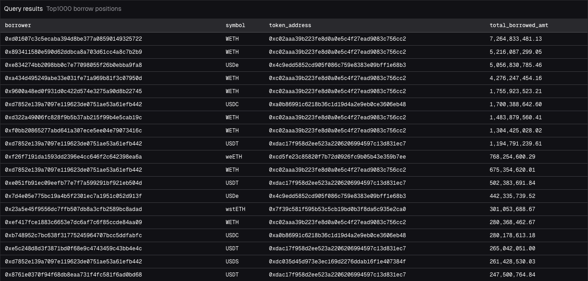
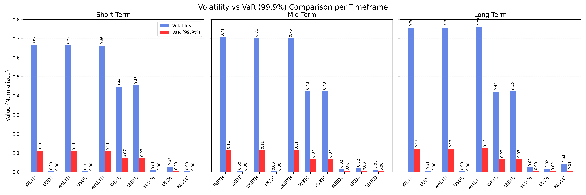
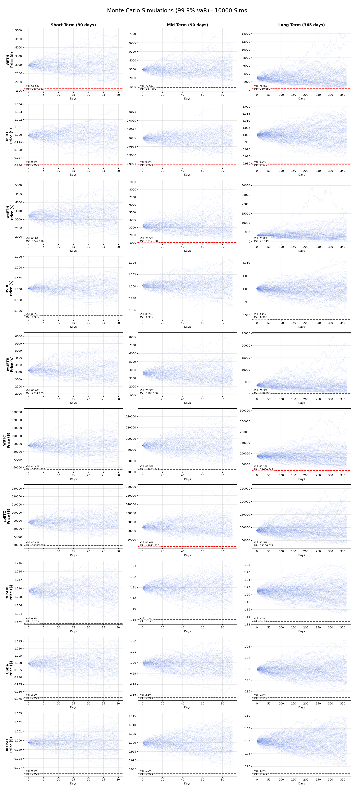
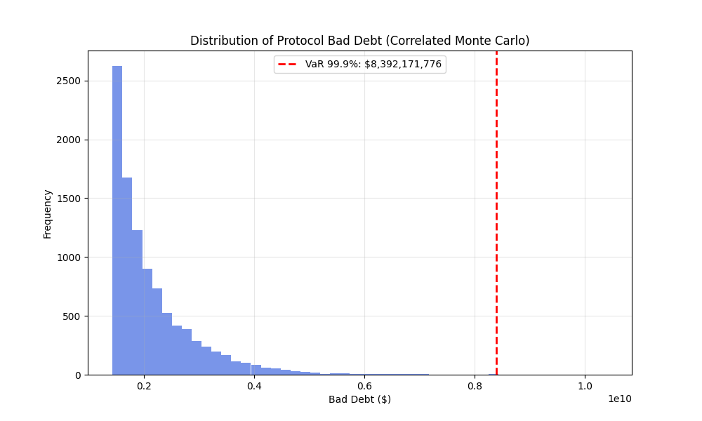

# Aave VaR Analysis & Bad Debt Simulation

This repository contains tools to estimate the Value at Risk (VaR) for the Aave protocol by simulating potential asset price movements and calculating resulting bad debt.

## 1. Setup

### 1.1. Clone the Repository
```bash
git clone https://github.com/your-username/aave-var.git
cd aave-var
```

### 1.2. Install Dependencies
```bash
uv venv .venv --python=3.11.12
source .venv/bin/activate
pip install -r requirements.txt
```

## 2. Fetch Data

To get the top 1000 borrow positions you can run the query in `positions.sql` on Dune and get the result as the image below.



Alternatively, we can use the GraphQL API to get the top 1000 borrow positions. To get them the script `fetch_positions.py` can be used.

To get the market data for the assets we use the CoinGecko. The script `fetch_market_data.py` can be used to get the market data for the top 10 assets supplied on Aave.

## 3. Methodology

### 3.1 Volatility Calculation

To asses the volatility of the different assets I used Coingecko Data to get the historical prices of the assets. Then the volatility is calculated using the standard deviation of the returns. To then get the annual volatility I used the formula $\sigma_{annual} = \sigma_{daily} \sqrt{365}$.

### 3.2 VaR Calculation
**Value at Risk (VaR)** is estimated at the **99.9% confidence level**. This means we are looking for the worst-case loss that is expected to occur only 1 in 1000 times (0.1% probability) over the given time horizon. The idea has been to get the VaR of the different assets on different time horizons, a short term (30 days), mid term (90 days) and long term (365 days). This allows us to get an idea of the risk of the protocol on different time horizons.

The VaR has been calculated using the supplied amount of each asset at the time of execution.

### 3.3 Monte Carlo Simulation
Our approach combines **Geometric Brownian Motion (GBM)** for price simulation with **Monte Carlo** methods to estimate the tail risk of the protocol's solvency.

#### The Model: Geometric Brownian Motion (GBM)
I have modelled the price evolution of each asset using Geometric Brownian Motion, a standard stochastic process for financial asset prices. The stochastic differential equation (SDE) is:

$$dS_t = \mu S_t dt + \sigma S_t dW_t$$

Where:
- $S_t$ is the asset price at time $t$.
- $\mu$ is the drift (assumed to be 0 for conservative risk estimation).
- $\sigma$ is the historical volatility of the asset.
- $dW_t$ is a Wiener process (Brownian motion).

For the simulation, I've discretized this process. To capture the inter-dependencies between assets (e.g., ETH and stETH moving together), I've used **Correlated Geometric Brownian Motion**. I've applied a **Cholesky Decomposition** to the correlation matrix of asset returns to generate correlated random shocks.

#### VaR Calculation
To estimate the VaR on the simulations I have simulated **10,000** scenariosn for price movements with the volatility of the assets. For each scenario:
1.  Update the price of all assets.
2.  Check every user's position (Debt vs Collateral).
3.  Calculate **Bad Debt**, defined as:
    $$\text{Bad Debt} = \sum_{\text{users}} \max(0, \text{Debt}_u - \text{Collateral}_u)$$

The protocol VaR is then the 99.9th percentile of this bad debt distribution.

## 4. Results & Visualization

### Volatility vs VaR Comparison
I analyzed three time horizons: **Short (30 days)**, **Mid (90 days)**, and **Long (365 days)**. The plot below shows the normalized Volatility and VaR (99.9%) for each asset.



*Observations:*
- Assets with higher volatility generally exhibit higher VaR, as expected. The stablecoin assets have the lowest volatility and the lowest VaR compared to the other assets which tend to be more volatile, with the exception of USDe which shows a slightly higher volatility than the other stablecoins, and RLUSD (but just on the long term).
- The Volatility increases significantly with the time horizon (Long term risk > Short term risk).

### Price Trajectories (Monte Carlo Matrix)
To visualize the range of outcomes, I've generated 10,000 sample trajectories for each asset across the three timeframes. The red dashed line indicates the 99.9% VaR price level (the 0.1th percentile price).



*Observations:*
- The price trajectories show the range of possible price movements for each asset across the three timeframes.
- On the short and mid term the price trajectories are far away from the 99.9% VaR price level, but on the long term the price trajectories are close to the 99.9% VaR price level, which is related to the fact of having higher volatility on the long term.

### Distribution of Bad Debt
The final Bad Debt simulation aggregates all user positions under correlated price scenarios. The histogram below shows the frequency of different bad debt outcomes. The red line marks the 99.9% VaR level.



## Usage

1.  **Fetch Data:** Run `fetch_positions.py` and `fetch_market_data.py` to get the positions and market data.
2. **Estimate VaR**: Run `estimate_var.py` to estimate the VaR for the different assets.
3. **Run MonteCarlo**: Run `monte_carlo.py` to run the Monte Carlo simulation over the estimated VaR and volatilities for the top10 Assets.
4.  **Get the Bad Debt:** Run `bad_debt.py` to get the bad debt for all the active positions.
5.  **Run Analysis:** Execute `analyze_var.py` to run the full correlated Monte Carlo simulation and generate the distribution plot.
6.  **Visualize:** Run `visualize_vol_var.py` to generate the bar chart comparisons.
